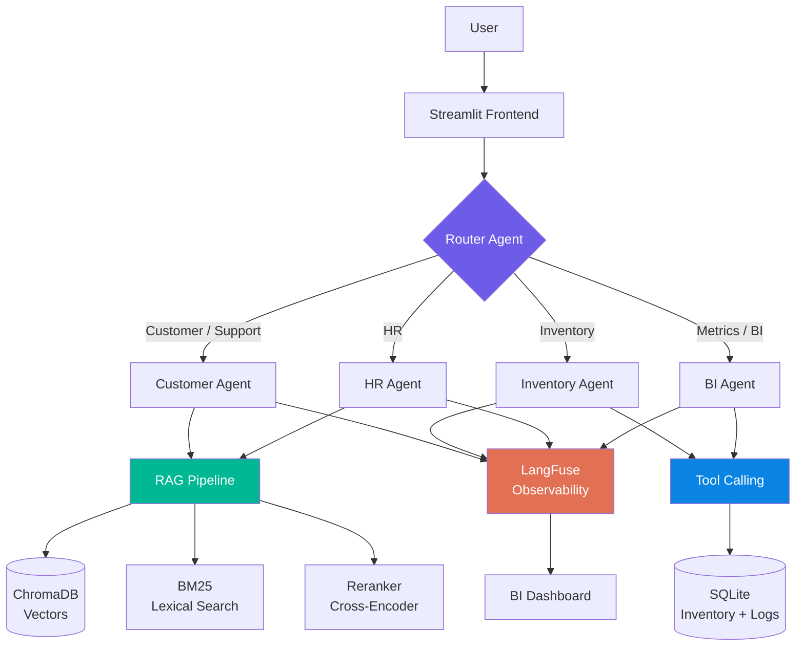
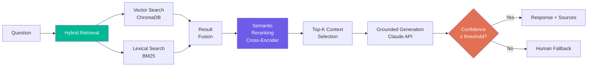

<h1 align="center">Vértice IA — Multi-Agent System for Retail/Industry</h1>

<p align="center">
  <strong>Intelligent autonomous service with advanced RAG, multi-agent orchestration, and observability</strong>
</p>

<p align="center">
  
  
   
  
  
  </p>

---

## Table of Contents

- [About the Project](#about-the-project)
- [Demo](#demo)
- [Architecture](#architecture)
- [Agents](#agents)
- [RAG Pipeline](#rag-pipeline)
- [Features](#features)
- [Tech Stack](#tech-stack)
- [Project Structure](#project-structure)
- [How to Run](#how-to-run)
- [RAG Evaluation](#rag-evaluation)
- [Observability](#observability)
- [Synthetic Data](#synthetic-data)
- [Roadmap](#roadmap)
- [Integrations](#integrations)
- [License](#license)

---

## About the Project

**Vértice** is a fictional urban fashion company with 20 own stores, an e-commerce platform, and ~1,000 employees distributed across 3 plants in Brazil.

This project implements a **multi-agent autonomous service system** that serves:

| Audience | Use case examples |
|---|---|
| **Customers** | Questions about returns, delivery times, warranty, order status |
| **Sales / Managers** | Stock queries by reference, size, color, and store |
| **Customer Support** | Assistance resolving tickets based on policies |
| **HR** | Questions about benefits, vacation, internal policies |

The system uses **advanced RAG** (Hybrid Retrieval + Semantic Reranking) to ground responses in real documents and **tool calling** for structured database queries, eliminating hallucinations and ensuring traceability.

### Why Does This Project Exist?

In e-commerce, support teams handle high volumes of repetitive questions — about policies, inventory, and internal processes. This system demonstrates how specialized AI agents can absorb this demand, freeing people for higher-value tasks.

---

## Demo

Access: **https://vertice.klauberfischer.online/**


---

## Architecture



### Request Flow

```
User question
    │
    ▼
┌─────────────────┐
│  Router Agent   │  ← Classifies intent + user profile
└────────┬────────┘
         │
    ┌────┴────┐
    │         │
    ▼         ▼
  [RAG]    [Tool Calling]
    │         │
    ▼         ▼
┌─────────────────────────────────────┐
│ 1. Retrieval (Vector + BM25)        │
│ 2. Semantic reranking               │
│ 3. Context selection                │  ← or direct SQL query
│ 4. Grounded generation              │
│ 5. Validation + confidence score    │
└────────────────┬────────────────────┘
                 │
                 ▼
┌─────────────────────────────────────┐
│ Response + Sources + Confidence     │
│ + Observability logs                │
└─────────────────────────────────────┘
```

---

## Agents

The system uses the **Claude Agent SDK** to orchestrate specialized agents:

| Agent | Responsibility | Primary Method |
|---|---|---|
| **Router** | Classifies message intent and routes to the correct agent | Classification with Claude |
| **Customer** | Answers questions about return, shipping, and warranty policies | RAG (documents) |
| **Inventory** | Queries availability by reference, size, color, and store | Tool Calling (SQL) |
| **HR** | Answers questions about benefits, vacation, payroll, and internal policies | RAG (documents) |
| **BI** | Provides metrics on interactions, frequent questions, critical inventory | Tool Calling (SQL) |

### Implemented Guardrails

- **Prompt injection detection** — suspicious messages are blocked before reaching the agent
- **Grounding validation** — responses without sufficient context return a low confidence warning
- **Human fallback** — when confidence is below the threshold, the system suggests escalation to a human agent
- **PII filter** — sensitive data (tax ID, phone number) is masked in logs

---

## RAG Pipeline



### Pipeline Components

| Stage | Technology | Description |
|---|---|---|
| Indexing | ChromaDB + sentence-transformers | Documents are chunked and indexed with embeddings |
| Vector search | ChromaDB | Retrieval by semantic similarity |
| Lexical search | rank_bm25 | Retrieval by term matching (TF-IDF) |
| Fusion | Reciprocal Rank Fusion | Combines rankings from both searches |
| Reranking | Cross-encoder (ms-marco-MiniLM) | Reorders by true semantic relevance |
| Generation | Claude API (Anthropic SDK) | Generates response grounded in selected context |
| Validation | Calibrated confidence score | Converts cross-encoder logits to confidence buckets |

### Confidence Score — Calibration for Portuguese

The reranker uses the `cross-encoder/ms-marco-MiniLM-L-6-v2` model, which was trained in English (MS MARCO). For Portuguese text, the output logits fall in a compressed and typically negative range, different from English behavior.

**Problem:** using logits directly would produce low confidence scores even for correct, well-grounded responses (for example, a perfect response about the return policy received logit `-6.08`).

**Adopted solution — empirically calibrated bucket system:**

```
Cross-encoder logit  →  Confidence score
─────────────────────────────────────────────
logit ≥  2.0         →  0.95  (explicit match / highly relevant)
logit ≥  0.5         →  0.82  (good semantic match)
logit ≥ -1.0         →  0.65  (weak but existing match)
logit <  -1.0        →  0.30  (low relevance found)
```

This calibration was derived by observing the model's actual behavior with Portuguese queries, ensuring correct responses receive appropriate scores without losing the ability to discriminate low relevance.

> **Technical note:** An alternative would be to translate the query to English before reranking, but since the documents remain in Portuguese, the gain would be marginal. The bucket approach is more straightforward and effective for this use case.

---

## Features

### Screen 1 — Chat with Agent

- Natural language conversation with the multi-agent system
- User profile identification (customer, sales rep, manager, HR)
- Visual indicator of **which agent** is responding
- **Sources used** displayed below the response
- **Confidence score** with visual indicator (high/medium/low)
- Feedback buttons (positive/negative) for each response

### Screen 2 — Inventory and Policy Query

- Interactive table with filters by category, color, size, and store
- Visual indicators of critical stock (below minimum)
- View of return, shipping, and warranty policies
- Text search in policies

### Screen 3 — BI Dashboard for Managers

- Total interactions handled by AI
- Autonomous resolution rate vs. human escalation
- Most frequent questions (word cloud + ranking)
- Average interaction time
- Distribution by agent and user profile
- Interaction timeline
- Critical inventory by store
- Average confidence score of responses

---

## Demo Interactions

```
# Customer interaction example
👤 User: I bought a T-shirt 15 days ago and have already worn it. Can I return it?

🤖 Customer Agent (confidence: 0.92):
According to our return policy, for a return to be accepted,
the product must show no signs of use and have its original packaging.
Since the T-shirt has already been worn, unfortunately it does not qualify
for a standard return.

However, if the item has a manufacturing defect, you may
request an assessment within 90 days of receipt.

📄 Sources: return_policy.md (sections: Return Conditions, Defective Products)
```

```
# Manager interaction example
👤 User: How many XS black VTX-CAM-001 T-shirts do we have at the Paulista store?

🤖 Inventory Agent (confidence: 0.99):
Reference VTX-CAM-001 (Urban Core T-Shirt - Black, XS size)
has 12 units in stock at the Av. Paulista store.

Configured minimum stock is 5 units.
Status: ✅ Adequate stock.

🔧 Tool: query_inventory(reference="VTX-CAM-001", color="black", size="XS", store="paulista")
```

---

## Tech Stack

| Layer | Technology | Justification |
|---|---|---|
| **LLM** | Claude API (Anthropic SDK) | High-quality model for generation and classification |
| **Orchestration** | Claude Agent SDK | Native framework for agents with tool calling |
| **Embeddings** | sentence-transformers (multilingual) | High-quality Portuguese embeddings |
| **Vector database** | ChromaDB | Lightweight, no extra infrastructure, ideal for MVP |
| **Lexical search** | rank_bm25 | Pure Python BM25, complements vector search |
| **Reranking** | Cross-encoder (ms-marco-MiniLM) | Semantic reranking + confidence calibration for PT-BR |
| **Relational database** | SQLite | Zero configuration, sufficient for MVP |
| **Observability** | LangFuse | Open source, full traces, native dashboards |
| **Frontend** | Streamlit | Rapid prototyping with professional look |
| **Containerization** | Docker Compose | Everything starts with one command |

---

## Project Structure

```
vertice-ia/
│
├── README.md                          # This file (Portuguese)
├── README-EN.md                       # English version
├── STATUS.md                          # Project status and progress
├── docker-compose.yml                 # Container orchestration
├── Dockerfile                         # Application image
├── requirements.txt                   # Python dependencies
├── .env.exemplo                       # Environment variables template
├── Makefile                           # Useful shortcuts (make run, make test, etc.)
│
├── configuracao/                      # General settings
│   ├── __init__.py
│   └── config.py                      # Variables, thresholds, parameters
│
├── dados/                             # Synthetic data and documents
│   ├── documentos/
│   │   ├── politica_devolucao.md
│   │   ├── politica_envio.md
│   │   ├── politica_garantia.md
│   │   ├── sobre_empresa.md
│   │   └── manual_rh.md
│   ├── base_estoque.csv               # 15 references × sizes × stores
│   ├── base_funcionarios.csv          # Synthetic HR data
│   └── dataset_avaliacao.json         # Questions + expected answers
│
├── agentes/                           # Specialized agents
│   ├── __init__.py
│   ├── roteador.py                    # Classifies intent and routes
│   ├── agente_cliente.py              # Customer service (RAG)
│   ├── agente_estoque.py              # Inventory queries (tool calling)
│   ├── agente_rh.py                   # HR service (RAG)
│   └── agente_bi.py                   # Metrics and analytics (tool calling)
│
├── rag/                               # RAG pipeline
│   ├── __init__.py
│   ├── indexador.py                   # Chunking + document indexing
│   ├── recuperador.py                 # Hybrid retrieval (vector + BM25)
│   ├── reranqueador.py                # Semantic reranking
│   └── pipeline.py                    # Orchestrates the full pipeline
│
├── ferramentas/                       # Agent tools
│   ├── __init__.py
│   ├── consulta_estoque.py            # SELECT on inventory database
│   └── consulta_metricas.py           # BI queries on interactions
│
├── banco/                             # Data layer
│   ├── __init__.py
│   ├── modelos.py                     # Table schemas
│   └── inicializador.py              # Database creation and seeding
│
├── guardrails/                        # Security and validation
│   ├── __init__.py
│   ├── detector_injection.py          # Prompt injection detection
│   ├── validador_resposta.py          # Grounding verification
│   └── filtro_pii.py                  # Sensitive data masking
│
├── observabilidade/                   # Logging and tracing
│   ├── __init__.py
│   └── rastreador.py                  # LangFuse integration
│
├── avaliacao/                         # RAG evaluation
│   ├── __init__.py
│   ├── avaliar_rag.py                 # Runs evaluation
│   └── metricas.py                    # Faithfulness, relevance, correctness
│
├── interface/                         # Streamlit frontend
│   ├── app.py                         # Entrypoint (sidebar + navigation)
│   ├── pagina_chat.py                 # Screen 1: Chat with agent
│   ├── pagina_estoque.py              # Screen 2: Inventory + policies
│   └── pagina_dashboard.py            # Screen 3: BI Dashboard
│
├── testes/                            # Automated tests
│   ├── teste_roteador.py
│   ├── teste_rag.py
│   ├── teste_estoque.py
│   └── teste_guardrails.py
│
└── docs/                              # Additional documentation
    ├── imagens/                       # Screenshots and diagrams
    ├── arquitetura.md                 # Architecture details
    └── decisoes_tecnicas.md           # ADRs (Architecture Decision Records)
```

---

## How to Run

### Prerequisites

- Python 3.11+
- Docker and Docker Compose (optional)
- Anthropic API key

### With Docker (recommended)

```bash
# 1. Clone the repository
git clone https://github.com/seu-usuario/vertice-ia.git
cd vertice-ia

# 2. Configure environment variables
cp .env.exemplo .env
# Edit .env and add your ANTHROPIC_API_KEY

# 3. Start everything
docker-compose up --build

# 4. Access in your browser
# http://localhost:8501
```

### Without Docker

```bash
# 1. Clone and enter the directory
git clone https://github.com/seu-usuario/vertice-ia.git
cd vertice-ia

# 2. Create and activate virtual environment
python -m venv .venv
source .venv/bin/activate  # Linux/Mac
# .venv\Scripts\activate   # Windows

# 3. Install dependencies
pip install -r requirements.txt

# 4. Configure the API key
cp .env.exemplo .env
# Edit .env and add your ANTHROPIC_API_KEY

# 5. Initialize the database and index documents
python -m banco.inicializador
python -m rag.indexador

# 6. Run the application
streamlit run interface/app.py
```

---

## RAG Evaluation

The project includes an evaluation pipeline with **30 questions** covering all system domains.

### Metrics

| Metric | Description | Target |
|---|---|---|
| **Faithfulness** | Is the response faithful to the retrieved context? | ≥ 0.85 |
| **Context Relevance** | Are the retrieved documents relevant? | ≥ 0.80 |
| **Correctness** | Is the response factually correct? | ≥ 0.80 |
| **Grounding Rate** | % of responses with identifiable sources | ≥ 0.90 |

### Run Evaluation

```bash
python -m avaliacao.avaliar_rag

# Expected output:
# ╔══════════════════════════╦═══════╗
# ║ Metric                   ║ Score ║
# ╠══════════════════════════╬═══════╣
# ║ Faithfulness             ║  0.91 ║
# ║ Context Relevance        ║  0.87 ║
# ║ Correctness              ║  0.85 ║
# ║ Grounding Rate           ║  0.93 ║
# ╚══════════════════════════╩═══════╝
```

---

## Observability

Every interaction is traced via **LangFuse**, generating traces with:

- Latency per stage (routing → retrieval → reranking → generation)
- Tokens consumed (input/output) and estimated cost
- Response confidence score
- User feedback (thumbs up/down)
- Retrieved context and selected sources

This data feeds the **BI Dashboard** (Screen 3) and enables monitoring of system health.

---

## Synthetic Data

### Company

Vértice has:
- **3 plants**: São Paulo (HQ + DC), Campinas (factory), Curitiba (regional DC)
- **20 own stores**: 8 in SP, 4 in RJ, 4 in Curitiba, 4 in Florianópolis
- **~1,000 employees**: 200 in stores, 700 in the factory, 50 corporate, 30 logistics, 20 IT
- **Annual revenue**: ~R$ 900M

### Inventory

15 references distributed across:
- **Categories**: T-shirts (7), pants (4), caps (4)
- **Sizes**: XS, S, M, L, XL
- **Colors**: varied by reference
- **Store inventory**: individual quantities for each store
- **Minimum stock**: configured per reference

### Policies

Detailed documents on:
- Return and exchange policy (30 days, conditions, refund)
- Shipping policy (processing, deadlines, tracking)
- Warranty policy (90 statutory days, coverage, process)
- HR manual (benefits, vacation, conduct)

---

## Integrations

The system core (router + agents + RAG + guardrails) is completely **channel-agnostic**. The Streamlit frontend is just one possible client — the agents expose a simple Python interface that can be called by any transport layer:

| Channel | How to integrate |
|---|---|
| **WhatsApp** | Webhook via Twilio, Meta Cloud API, or Evolution API |
| **Telegram** | python-telegram-bot + webhook |
| **Slack** | Slack Bolt SDK + message events |
| **Corporate omnichannel** | REST API (FastAPI/Flask) over the agents |
| **Own API** | Direct REST wrapper — 1 endpoint `/chat` receives `{message, profile}` and returns `{response, agent, score, sources}` |

> The routing, RAG, and guardrails logic doesn't change — only the input/output adapter is swapped per channel.

## Author

Klauber Fischer

---

## License

MIT
