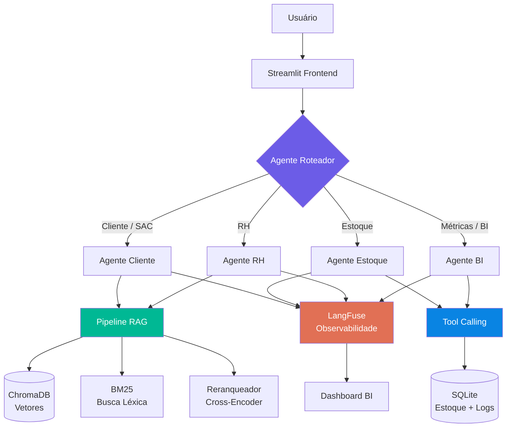
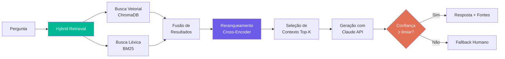

<p align="center">
  
</p>

<h1 align="center">Vértice IA — Sistema Multi-Agente para Indústria Têxtil</h1>

<p align="center">
  <strong>Atendimento autônomo inteligente com RAG avançado, orquestração multi-agente e observabilidade</strong>
</p>

<p align="center">
  
  
  
  
  
  
  
</p>

---

## Sumário

- [Sobre o Projeto](#sobre-o-projeto)
- [Arquitetura](#arquitetura)
- [Agentes](#agentes)
- [Pipeline RAG](#pipeline-rag)
- [Funcionalidades](#funcionalidades)
- [Demonstração](#demonstração)
- [Stack Tecnológica](#stack-tecnológica)
- [Estrutura do Projeto](#estrutura-do-projeto)
- [Como Executar](#como-executar)
- [Avaliação do RAG](#avaliação-do-rag)
- [Observabilidade](#observabilidade)
- [Dados Fictícios](#dados-fictícios)
- [Roadmap](#roadmap)
- [Integrações](#integrações)
- [English Summary](#english-summary)
- [Licença](#licença)

---

## Sobre o Projeto

A **Vértice** é uma empresa fictícia de moda urbana com 20 lojas próprias, e-commerce e ~1000 funcionários distribuídos em 3 plantas no Brasil.

Este projeto implementa um **sistema multi-agente de atendimento autônomo** que atende:

| Público | Exemplos de uso |
|---|---|
| **Clientes** | Dúvidas sobre devoluções, prazos de entrega, garantia, status de pedido |
| **Vendedores / Gerentes** | Consulta de estoque por referência, tamanho, cor e loja |
| **SAC** | Apoio para resolução de chamados com base nas políticas |
| **RH** | Dúvidas sobre benefícios, férias, políticas internas |

O sistema utiliza **RAG avançado** (Hybrid Retrieval + Semantic Reranking) para fundamentar respostas em documentos reais e **tool calling** para consultas estruturadas ao banco de dados, eliminando alucinações e garantindo rastreabilidade.

### Por que este projeto existe?

Na indústria têxtil brasileira, equipes de atendimento lidam com alto volume de perguntas repetitivas — sobre políticas, estoque e processos internos. Este sistema demonstra como agentes de IA especializados podem absorver essa demanda, liberando pessoas para tarefas de maior valor.

---

## Arquitetura



### Fluxo de uma requisição

```
Pergunta do usuário
    │
    ▼
┌─────────────────┐
│ Agente Roteador  │  ← Classifica intenção + perfil do usuário
└────────┬────────┘
         │
    ┌────┴────┐
    │         │
    ▼         ▼
  [RAG]    [Tool Calling]
    │         │
    ▼         ▼
┌─────────────────────────────────────┐
│ 1. Recuperação (Vetorial + BM25)    │
│ 2. Reranqueamento semântico         │
│ 3. Seleção de contexto              │  ← ou consulta SQL direta
│ 4. Geração fundamentada             │
│ 5. Validação + score de confiança   │
└────────────────┬────────────────────┘
                 │
                 ▼
┌─────────────────────────────────────┐
│ Resposta + Fontes + Confiança       │
│ + Logs de observabilidade           │
└─────────────────────────────────────┘
```

---

## Agentes

O sistema utiliza o **Claude Agent SDK** para orquestrar agentes especializados:

| Agente | Responsabilidade | Método Principal |
|---|---|---|
| **Roteador** | Classifica a intenção da mensagem e direciona ao agente correto | Classificação com Claude |
| **Cliente** | Responde dúvidas sobre políticas de devolução, envio e garantia | RAG (documentos) |
| **Estoque** | Consulta disponibilidade por referência, tamanho, cor e loja | Tool Calling (SQL) |
| **RH** | Responde sobre benefícios, férias, folha e políticas internas | RAG (documentos) |
| **BI** | Fornece métricas sobre atendimentos, perguntas frequentes, estoque crítico | Tool Calling (SQL) |

### Guardrails implementados

- **Detecção de prompt injection** — mensagens suspeitas são bloqueadas antes de chegar ao agente
- **Validação de fundamentação** — respostas sem contexto suficiente retornam aviso de baixa confiança
- **Fallback humano** — quando a confiança é inferior ao limiar, o sistema sugere encaminhamento para atendente
- **Filtro de PII** — dados sensíveis (CPF, telefone) são mascarados nos logs

---

## Pipeline RAG



### Componentes do pipeline

| Etapa | Tecnologia | Descrição |
|---|---|---|
| Indexação | ChromaDB + sentence-transformers | Documentos são chunked e indexados com embeddings |
| Busca vetorial | ChromaDB | Recuperação por similaridade semântica |
| Busca léxica | rank_bm25 | Recuperação por correspondência de termos (TF-IDF) |
| Fusão | Reciprocal Rank Fusion | Combina rankings das duas buscas |
| Reranqueamento | Cross-encoder (ms-marco-MiniLM) | Reordena por relevância semântica real |
| Geração | Claude API (Anthropic SDK) | Gera resposta fundamentada no contexto selecionado |
| Validação | Score de confiança calibrado | Converte logits do cross-encoder em buckets de confiança |

### Score de Confiança — Calibração para Português

O reranqueador utiliza o modelo `cross-encoder/ms-marco-MiniLM-L-6-v2`, que foi treinado em inglês (MS MARCO). Para texto em português, os logits de saída ficam em uma faixa comprimida e tipicamente negativa, diferente do comportamento em inglês.

**Problema:** usar os logits diretamente produziria scores de confiança baixos mesmo para respostas corretas e bem fundamentadas (por exemplo, uma resposta perfeita sobre a política de devolução recebia logit `-6.08`).

**Solução adotada — sistema de buckets calibrado empiricamente:**

```
Logit do cross-encoder  →  Score de confiança
─────────────────────────────────────────────
logit ≥  2.0            →  0.95  (match explícito / muito relevante)
logit ≥  0.5            →  0.82  (match semântico bom)
logit ≥ -1.0            →  0.65  (match fraco mas existente)
logit <  -1.0           →  0.30  (pouca relevância encontrada)
```

Essa calibração foi derivada observando o comportamento real do modelo com consultas em português, garantindo que respostas corretas recebam scores adequados sem perder a capacidade de discriminar baixa relevância.

> **Nota técnica:** Uma alternativa seria traduzir a consulta para inglês antes do reranqueamento, mas como os documentos permanecem em português, o ganho seria marginal. A abordagem de buckets é mais direta e eficaz para este caso de uso.

---

## Funcionalidades

### Tela 1 — Chat com Agente

<p align="center">
  
</p>

- Conversa em linguagem natural com o sistema multi-agente
- Identificação do perfil do usuário (cliente, vendedor, gerente, RH)
- Indicador visual de **qual agente** está respondendo
- **Fontes utilizadas** exibidas abaixo da resposta
- **Score de confiança** com indicador visual (alto/médio/baixo)
- Botões de feedback (positivo/negativo) para cada resposta

### Tela 2 — Consulta de Estoque e Políticas

<p align="center">
  
</p>

- Tabela interativa com filtros por categoria, cor, tamanho e loja
- Indicadores visuais de estoque crítico (abaixo do mínimo)
- Visualização das políticas de devolução, envio e garantia
- Busca textual nas políticas

### Tela 3 — Dashboard BI para Gestores

<p align="center">
  
</p>

- Total de atendimentos realizados pela IA
- Taxa de resolução autônoma vs. encaminhamento humano
- Dúvidas mais frequentes (word cloud + ranking)
- Tempo médio de atendimento
- Distribuição por agente e por perfil de usuário
- Evolução temporal dos atendimentos
- Estoque crítico por loja
- Score médio de confiança das respostas

---

## Demonstração

> **GIFs e screenshots serão adicionados após a implementação.**

```
# Exemplo de interação — Cliente
👤 Usuário: Comprei uma camiseta há 15 dias e já usei. Posso devolver?

🤖 Agente Cliente (confiança: 0.92):
De acordo com a nossa política de devolução, para que a devolução seja aceita,
o produto deve estar sem sinais de uso e com a embalagem original.
Como a camiseta já foi utilizada, infelizmente ela não se enquadra
nas condições para devolução padrão.

No entanto, caso a peça apresente defeito de fabricação, você pode
solicitar análise em até 90 dias após o recebimento.

📄 Fontes: politica_devolucao.md (seções: Condições para devolução, Produtos com defeito)
```

```
# Exemplo de interação — Gerente
👤 Usuário: Quantas camisetas PP pretas da ref. VTX-CAM-001 temos na loja Paulista?

🤖 Agente Estoque (confiança: 0.99):
A referência VTX-CAM-001 (Camiseta Urban Core - Preta, tamanho PP)
possui 12 unidades em estoque na loja Av. Paulista.

O estoque mínimo configurado é de 5 unidades.
Status: ✅ Estoque adequado.

🔧 Ferramenta: consulta_estoque(referencia="VTX-CAM-001", cor="preta", tamanho="PP", loja="paulista")
```

---

## Stack Tecnológica

| Camada | Tecnologia | Justificativa |
|---|---|---|
| **LLM** | Claude API (Anthropic SDK) | Modelo de alta qualidade para geração e classificação |
| **Orquestração** | Claude Agent SDK | Framework nativo para agentes com tool calling |
| **Embeddings** | sentence-transformers (multilingual) | Embeddings em português de alta qualidade |
| **Banco vetorial** | ChromaDB | Leve, sem infra extra, ideal para MVP |
| **Busca léxica** | rank_bm25 | BM25 puro em Python, complementa busca vetorial |
| **Reranqueamento** | Cross-encoder (ms-marco-MiniLM) | Reranqueamento semântico + calibração de confiança para PT-BR |
| **Banco relacional** | SQLite | Zero configuração, suficiente para MVP |
| **Observabilidade** | LangFuse | Open source, traces completos, dashboards nativos |
| **Frontend** | Streamlit | Prototipagem rápida com visual profissional |
| **Containerização** | Docker Compose | Tudo sobe com um comando |

---

## Estrutura do Projeto

```
vertice-ia/
│
├── README.md                          # Este arquivo
├── README_EN.md                       # English version
├── STATUS.md                          # Status e progresso do projeto
├── docker-compose.yml                 # Orquestração de containers
├── Dockerfile                         # Imagem da aplicação
├── requirements.txt                   # Dependências Python
├── .env.exemplo                       # Template de variáveis de ambiente
├── Makefile                           # Atalhos úteis (make run, make test, etc.)
│
├── configuracao/                      # Configurações gerais
│   ├── __init__.py
│   └── config.py                      # Variáveis, limiares, parâmetros
│
├── dados/                             # Dados fictícios e documentos
│   ├── documentos/
│   │   ├── politica_devolucao.md
│   │   ├── politica_envio.md
│   │   ├── politica_garantia.md
│   │   ├── sobre_empresa.md
│   │   └── manual_rh.md
│   ├── base_estoque.csv               # 15 referências × tamanhos × lojas
│   ├── base_funcionarios.csv          # Dados fictícios de RH
│   └── dataset_avaliacao.json         # Perguntas + respostas esperadas
│
├── agentes/                           # Agentes especializados
│   ├── __init__.py
│   ├── roteador.py                    # Classifica intenção e direciona
│   ├── agente_cliente.py              # Atendimento ao cliente (RAG)
│   ├── agente_estoque.py              # Consultas de estoque (tool calling)
│   ├── agente_rh.py                   # Atendimento RH (RAG)
│   └── agente_bi.py                   # Métricas e analytics (tool calling)
│
├── rag/                               # Pipeline de RAG
│   ├── __init__.py
│   ├── indexador.py                   # Chunking + indexação de documentos
│   ├── recuperador.py                 # Hybrid retrieval (vetorial + BM25)
│   ├── reranqueador.py                # Semantic reranking
│   └── pipeline.py                    # Orquestra o pipeline completo
│
├── ferramentas/                       # Tools para os agentes
│   ├── __init__.py
│   ├── consulta_estoque.py            # SELECT no banco de estoque
│   └── consulta_metricas.py           # Queries de BI sobre atendimentos
│
├── banco/                             # Camada de dados
│   ├── __init__.py
│   ├── modelos.py                     # Schemas das tabelas
│   └── inicializador.py              # Criação e seed do banco
│
├── guardrails/                        # Segurança e validação
│   ├── __init__.py
│   ├── detector_injection.py          # Detecção de prompt injection
│   ├── validador_resposta.py          # Verifica fundamentação
│   └── filtro_pii.py                  # Mascara dados sensíveis
│
├── observabilidade/                   # Logging e tracing
│   ├── __init__.py
│   └── rastreador.py                  # Integração com LangFuse
│
├── avaliacao/                         # Avaliação do RAG
│   ├── __init__.py
│   ├── avaliar_rag.py                 # Executa avaliação
│   └── metricas.py                    # Faithfulness, relevância, correção
│
├── interface/                         # Frontend Streamlit
│   ├── app.py                         # Entrypoint (sidebar + navegação)
│   ├── pagina_chat.py                 # Tela 1: Chat com agente
│   ├── pagina_estoque.py              # Tela 2: Estoque + políticas
│   └── pagina_dashboard.py            # Tela 3: Dashboard BI
│
├── testes/                            # Testes automatizados
│   ├── teste_roteador.py
│   ├── teste_rag.py
│   ├── teste_estoque.py
│   └── teste_guardrails.py
│
└── docs/                              # Documentação adicional
    ├── imagens/                       # Screenshots e diagramas
    ├── arquitetura.md                 # Detalhamento da arquitetura
    └── decisoes_tecnicas.md           # ADRs (Architecture Decision Records)
```

---

## Como Executar

### Pré-requisitos

- Python 3.11+
- Docker e Docker Compose (opcional)
- Chave de API da Anthropic

### Com Docker (recomendado)

```bash
# 1. Clone o repositório
git clone https://github.com/seu-usuario/vertice-ia.git
cd vertice-ia

# 2. Configure as variáveis de ambiente
cp .env.exemplo .env
# Edite .env e adicione sua ANTHROPIC_API_KEY

# 3. Suba tudo
docker-compose up --build

# 4. Acesse no navegador
# http://localhost:8501
```

### Sem Docker

```bash
# 1. Clone e entre no diretório
git clone https://github.com/seu-usuario/vertice-ia.git
cd vertice-ia

# 2. Crie e ative o ambiente virtual
python -m venv .venv
source .venv/bin/activate  # Linux/Mac
# .venv\Scripts\activate   # Windows

# 3. Instale as dependências
pip install -r requirements.txt

# 4. Configure a API key
cp .env.exemplo .env
# Edite .env e adicione sua ANTHROPIC_API_KEY

# 5. Inicialize o banco e indexe os documentos
python -m banco.inicializador
python -m rag.indexador

# 6. Execute a aplicação
streamlit run interface/app.py
```

### Comandos úteis (Makefile)

```bash
make run          # Sobe a aplicação
make indexar      # Reindexar documentos no RAG
make avaliar      # Rodar avaliação do RAG
make testes       # Rodar testes automatizados
make limpar       # Limpar banco e índices
```

---

## Avaliação do RAG

O projeto inclui um pipeline de avaliação com **30 perguntas** cobrindo todos os domínios do sistema.

### Métricas

| Métrica | Descrição | Meta |
|---|---|---|
| **Fidelidade** (Faithfulness) | A resposta é fiel ao contexto recuperado? | ≥ 0.85 |
| **Relevância do Contexto** | Os documentos recuperados são relevantes? | ≥ 0.80 |
| **Correção** (Correctness) | A resposta está factualmente correta? | ≥ 0.80 |
| **Taxa de Fundamentação** | % de respostas com fontes identificáveis | ≥ 0.90 |

### Executar avaliação

```bash
python -m avaliacao.avaliar_rag

# Saída esperada:
# ╔══════════════════════════╦═══════╗
# ║ Métrica                  ║ Score ║
# ╠══════════════════════════╬═══════╣
# ║ Fidelidade               ║  0.91 ║
# ║ Relevância do Contexto   ║  0.87 ║
# ║ Correção                 ║  0.85 ║
# ║ Taxa de Fundamentação    ║  0.93 ║
# ╚══════════════════════════╩═══════╝
```

---

## Observabilidade

Toda interação é rastreada via **LangFuse**, gerando traces com:

- Latência por etapa (roteamento → retrieval → reranking → geração)
- Tokens consumidos (input/output) e custo estimado
- Score de confiança da resposta
- Feedback do usuário (polegar cima/baixo)
- Contexto recuperado e fontes selecionadas

Esses dados alimentam o **Dashboard BI** (Tela 3) e permitem monitorar a saúde do sistema.

---

## Dados Fictícios

### Empresa

A Vértice possui:
- **3 plantas**: São Paulo (sede + CD), Campinas (fábrica), Curitiba (CD regional)
- **20 lojas próprias**: 8 em SP, 4 no RJ, 4 em Curitiba, 4 em Florianópolis
- **~1000 funcionários**: 200 nas lojas, 700 na fábrica, 50 corporativo, 30 logística, 20 TI
- **Faturamento anual**: ~R$ 900M

### Estoque

15 referências distribuídas em:
- **Categorias**: camisetas (7), calças (4), bonés (4)
- **Tamanhos**: PP, P, M, G, GG
- **Cores**: variadas por referência
- **Estoque por loja**: quantidades individuais para cada loja
- **Estoque mínimo**: configurado por referência

### Políticas

Documentos detalhados de:
- Política de devolução e troca (30 dias, condições, reembolso)
- Política de envio (processamento, prazos, rastreamento)
- Política de garantia (90 dias legais, cobertura, processo)
- Manual de RH (benefícios, férias, conduta)

---

## Integrações

O núcleo do sistema (roteador + agentes + RAG + guardrails) é completamente **independente de canal**. O frontend Streamlit é apenas um dos possíveis clientes — os agentes expõem uma interface Python simples que pode ser chamada por qualquer camada de transporte:

| Canal | Como integrar |
|---|---|
| **WhatsApp** | Webhook via Twilio, Meta Cloud API ou Evolution API |
| **Telegram** | python-telegram-bot + webhook |
| **Slack** | Slack Bolt SDK + eventos de mensagem |
| **Omnichannel corporativo** | API REST (FastAPI/Flask) sobre os agentes |
| **API própria** | Wrapper REST direto — 1 endpoint `/chat` recebe `{mensagem, perfil}` e retorna `{resposta, agente, score, fontes}` |

> A lógica de roteamento, RAG e guardrails não muda — apenas o adaptador de entrada/saída é trocado por canal.

---

## English Summary

**Vértice IA** is a multi-agent AI system built for a fictional Brazilian textile company. It demonstrates:

- **Multi-agent orchestration** using Claude Agent SDK — a router agent classifies user intent and delegates to specialized agents (Customer Service, Inventory, HR, BI)
- **Advanced RAG pipeline** — Hybrid Retrieval (vector + BM25), semantic reranking with cross-encoders (`ms-marco-MiniLM`), empirically calibrated confidence scoring for Portuguese text, and source attribution
- **Tool calling** — agents query a SQLite database for real-time inventory and analytics data
- **Guardrails** — prompt injection detection, response grounding validation, PII filtering, and human fallback
- **Observability** — full tracing with LangFuse (latency, tokens, confidence, user feedback)
- **RAG evaluation** — 30-question benchmark with faithfulness, relevance, and correctness metrics
- **BI Dashboard** — analytics on AI-handled interactions, resolution rates, common questions, and inventory alerts

The agent core is **channel-agnostic**: the Streamlit UI is one possible client, but the same routing + RAG + guardrails logic can be plugged into WhatsApp, Telegram, Slack, or any corporate omnichannel platform via a simple REST adapter.

**Tech stack**: Claude API (Anthropic SDK), Claude Agent SDK, ChromaDB, rank_bm25, cross-encoder reranking, SQLite, LangFuse, Streamlit, Docker Compose.

---


